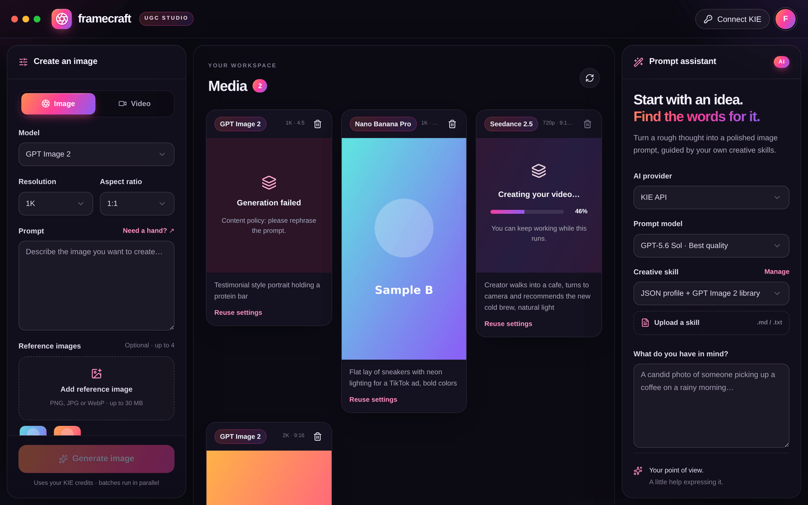

# Framecraft · UGC Studio

Estudio para crear contenido UGC (imágenes y vídeos) con KIE
(GPT Image 2, Nano Banana Pro, Seedance 2.5) y un asistente de prompts con IA.

- **macOS:** app nativa en Swift/SwiftUI → ver [`macos/README.md`](macos/README.md)
  (descarga: Actions → *macOS app (Swift)* → Artifacts → *Framecraft-macOS*).
- **Windows:** app de escritorio (Electron) → instrucciones abajo.
- **Navegador:** la versión web original (Next.js/vinext).



## Descargar las apps (sin instalar nada de programación)

Las instaladoras se generan solas en GitHub cada vez que se suben cambios:

1. En GitHub abre la pestaña **Actions** → workflow **Desktop apps**.
2. Entra en la ejecución más reciente (con ✅ verde).
3. Abajo, en **Artifacts**, descarga:
   - `Framecraft-Windows` → Windows 10/11 (`.exe`, instalador), desde el
     workflow **Windows app (Electron)**.
   - Para Mac usá la app nativa: workflow **macOS app (Swift)** →
     `Framecraft-macOS` (`.dmg`, Apple Silicon e Intel).

Si publicas una etiqueta de versión (`v1.0.1`, etc.), las instaladoras también
se adjuntan a un borrador de *Release*.

### Primera apertura en macOS

La app aún no está firmada con un certificado de Apple Developer, así que la
primera vez macOS la bloqueará:

1. Arrastra **Framecraft** a **Aplicaciones**.
2. Haz **clic derecho → Abrir** → **Abrir**. (Solo la primera vez.)
3. Si dice que "está dañada", abre Terminal y ejecuta una vez:
   `xattr -cr /Applications/Framecraft.app`

### Primera apertura en Windows

Windows SmartScreen puede avisar porque el instalador no está firmado:
pulsa **Más información → Ejecutar de todas formas**.

## Qué hace la app de escritorio

- Arranca un servidor local privado (solo accesible desde tu equipo y solo
  desde la ventana de Framecraft, protegido con un token por sesión).
- Inicia sesión automáticamente con tu perfil local: no hay cuentas externas.
- **macOS:** ventana con efecto *vibrancy* translúcido y semáforos integrados en
  la barra superior.
- **Windows 11:** material **Mica** y botones de ventana integrados
  (Windows 10 usa un fondo sólido).
- Recuerda el tamaño y la posición de la ventana.
- Menú **Framecraft/Archivo → Abrir carpeta de datos / Ver registro del servidor**.


## Tus datos

Todo se guarda solo en tu equipo:

| Sistema | Carpeta |
|---|---|
| macOS | `~/Library/Application Support/Framecraft/Framecraft-Data` |
| Windows | `%APPDATA%\Framecraft\Framecraft-Data` |

- `state/` → base de datos, imágenes y vídeos generados, referencias.
- `secrets.env` → clave que cifra tus API keys de KIE/OpenAI.
  **Si haces copia de seguridad, copia la carpeta completa**: sin
  `secrets.env` las claves guardadas no se pueden descifrar.

## Desarrollo

Requisitos: Node.js 24.

```bash
npm ci
npm run desktop:dev      # compila y abre la app de escritorio
npm run desktop:smoke    # prueba automática: arranca y comprueba el estudio
npm run lint
```

Modo navegador (como antes):

```bash
npm run setup:local
npm run dev -- --host 127.0.0.1 --strictPort   # http://localhost:5173
```

Empaquetar a mano (cada sistema en su propia máquina):

```bash
npm run desktop:mac:arm64   # en un Mac Apple Silicon
npm run desktop:mac:x64     # en un Mac Intel
npm run desktop:win         # en Windows
```

Las instaladoras quedan en `release/`.

### Estructura

| Ruta | Qué es |
|---|---|
| `app/` | Interfaz (Next.js/vinext) y API (`app/api/[...path]/route.ts`) |
| `app/globals.css` | Tema visual (aurora, paneles de vidrio, estilos de escritorio) |
| `desktop/main.cjs` | Proceso principal de Electron: ventana, menú, cabeceras |
| `desktop/server.cjs` | Arranca Wrangler/workerd con los datos en la carpeta del usuario |
| `desktop/splash.html` | Pantalla de carga y de error |
| `desktop/assets/` | Iconos de la app (fuente SVG + PNG) |
| `electron-builder.yml` | Configuración de las instaladoras |
| `.github/workflows/desktop.yml` | Genera `.dmg` y `.exe` en GitHub Actions |

### Firma de código (opcional)

Para que macOS y Windows no muestren avisos hace falta firmar:

- **macOS:** cuenta de Apple Developer. Configura los secretos `CSC_LINK`,
  `CSC_KEY_PASSWORD`, `APPLE_ID`, `APPLE_APP_SPECIFIC_PASSWORD`, `APPLE_TEAM_ID`,
  cambia `identity` en `electron-builder.yml` y activa `notarize`.
- **Windows:** certificado de firma de código (`CSC_LINK` / `CSC_KEY_PASSWORD`)
  o Azure Trusted Signing.
