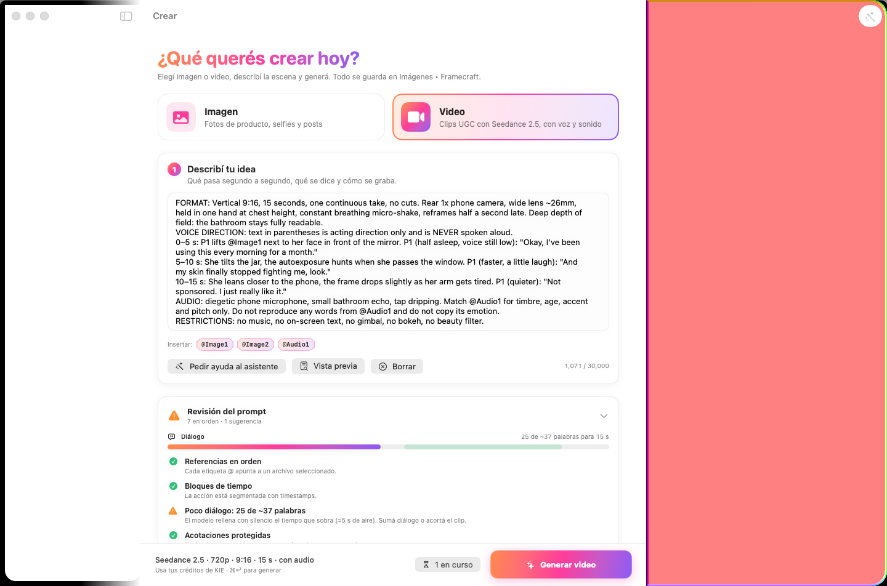
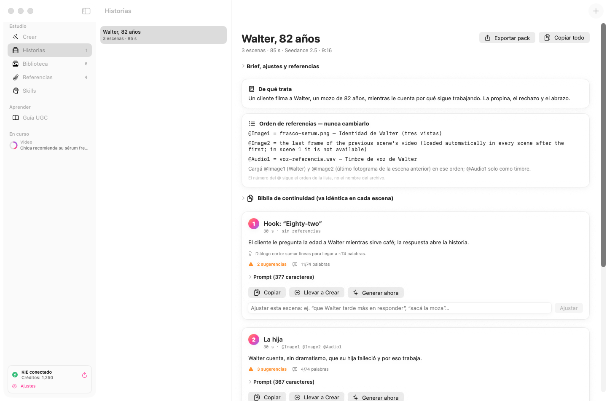
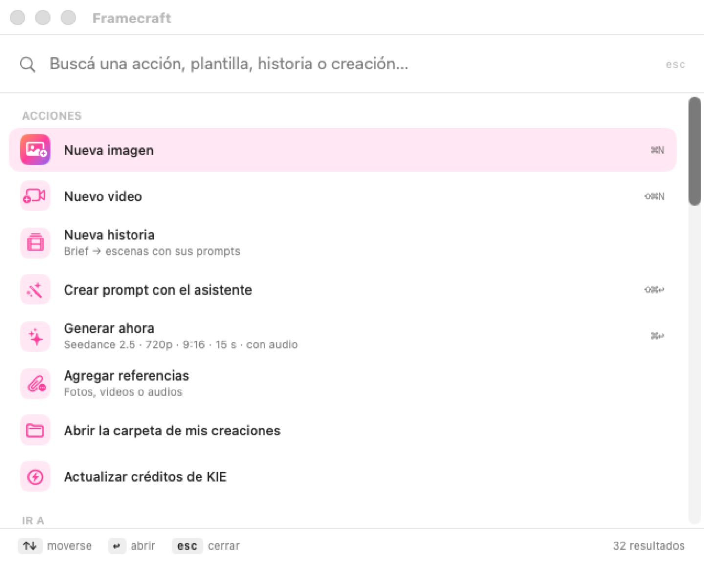
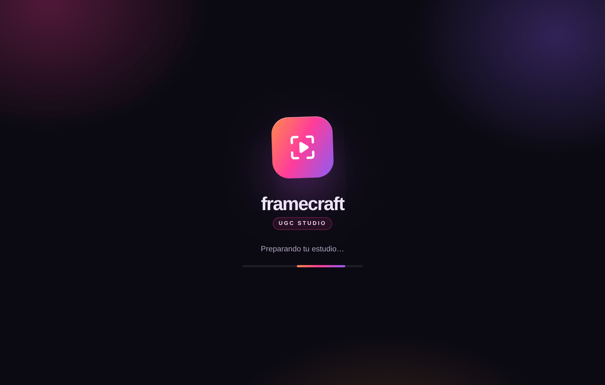

# Framecraft · UGC Studio

Estudio para crear contenido UGC —fotos y videos que parecen grabados con un
celular— con KIE (**GPT Image 2**, **Nano Banana Pro** y **Seedance 2.5**), un
asistente de prompts con IA y una sección de **Historias** que convierte un brief
en todas las escenas de un video largo.



## Descargar

| Sistema | Qué bajar | Dónde |
|---|---|---|
| **macOS 14+** (Apple Silicon e Intel) | `Framecraft-…-macOS.dmg` o el `.zip` | [**Releases**](https://github.com/arenx93/UGC-App/releases) (la más reciente) |
| **Windows 10/11** | `Framecraft-Windows` (`.exe`) | Actions → *Windows app (Electron)* → Artifacts |

El repositorio es privado: las Releases solo las ven las personas con acceso.
Las compilaciones de cada cambio también quedan en **Actions → macOS app (Swift) → Artifacts**.

### Instalar en Mac

1. Descargá el `.dmg` (o el `.zip` y hacé doble clic para sacar el `.dmg`).
2. Abrilo y arrastrá **Framecraft** a **Aplicaciones**.
3. **La primera vez** macOS puede bloquearla porque todavía no está firmada con un
   certificado de Apple Developer. En macOS 15 o posterior el “clic derecho → Abrir”
   ya no alcanza; usá una de estas dos opciones:
   - **Ajustes del Sistema → Privacidad y seguridad** → *Abrir igualmente*.
   - En **Terminal**, una sola vez: `xattr -dr com.apple.quarantine /Applications/Framecraft.app`
4. Al abrir, pegá tu clave de KIE (se guarda en el Llavero de macOS) y listo.

## La app de Mac

Nativa, escrita 100 % en Swift y SwiftUI. En macOS 26 o posterior usa el diseño
**Liquid Glass**; en macOS 14 y 15, materiales equivalentes.

| | |
|---|---|
| **Crear** | Imagen o video en tres pasos, con plantillas (testimonio, unboxing, GRWM, antes y después, entrevista callejera, foto de producto, flat lay…), referencias @Image/@Video/@Audio y ⌘↩ para generar. |
| **Asistente de prompts** | Tu idea → un prompt listo siguiendo una *skill* (UGC de celular · Seedance 2.5, Arthas y Cachito, perfil JSON o las tuyas). Texto en vivo, ajustes (“más corto”) y versiones anteriores. |
| **Revisión del prompt** | Chequea bloques de tiempo, densidad de diálogo (2,47 palabras/s), etiquetas que no existen, lenguaje de anuncio y restricciones. |
| **Historias** | Un brief → la historia en escenas, cada una con su prompt, de qué trata y el orden de las referencias. Storyboard, ajuste escena por escena, **Generar todas las escenas** (encadenadas con el último fotograma) y **Armar video final** en un solo MP4, en tu Mac y sin créditos. |
| **Biblioteca** | Todo lo generado, con búsqueda, favoritos, videos que se reproducen al pasar el mouse, Vista rápida, compartir y “continuar desde el último fotograma”. |
| **Paleta de comandos** (⌘K) | Ir a cualquier pantalla, usar una plantilla, abrir una historia o una creación vieja. |
| **Barra de menús** | Progreso de tus videos y últimas creaciones aunque cierres la ventana. |

### Motores del asistente

| Motor | Qué usa |
|---|---|
| **KIE** | GPT‑5.6 Terra / Luna / Sol, GPT 5.2, Gemini 3.8 Flash, Gemini 3 Flash, Claude Opus 4.6, con tu clave de KIE. |
| **ChatGPT (Codex)** | Tu cuenta de ChatGPT. Codex viene incluido en la app: solo iniciás sesión. |
| **En este Mac** | Apple Intelligence (macOS 26+, Apple Silicon): gratis, privado y sin internet. Para prompts cortos. |
| **OpenAI API** | GPT‑4.1 mini con tu clave de OpenAI (opcional). |

| Historias | Paleta ⌘K |
|---|---|
|  |  |

Más detalles y capturas en [`macos/README.md`](macos/README.md) y [`docs/macos/`](docs/macos/).

### Publicar una versión nueva de Mac

Subí una etiqueta `mac-v<versión>` (por ejemplo `mac-v1.2.0`): GitHub Actions compila,
prueba y publica la Release con el `.dmg` y el `.zip`. Si se cargan los secretos
de Apple Developer (`MACOS_CERTIFICATE_P12`, `MACOS_CERTIFICATE_PASSWORD`,
`MACOS_SIGN_IDENTITY` y `APPLE_API_KEY_*`), la app sale firmada y notarizada y
macOS deja de bloquearla.

## Windows y versión web

La versión de Windows es una app de escritorio (Electron) sobre la versión web
original (Next.js/vinext), que también se puede usar en el navegador.

**Primera apertura en Windows:** SmartScreen puede avisar porque el instalador no
está firmado: tocá **Más información → Ejecutar de todas formas**.

### Qué hace la app de Windows

- Arranca un servidor local privado (solo accesible desde tu equipo y solo
  desde la ventana de Framecraft, protegido con un token por sesión).
- Inicia sesión automáticamente con tu perfil local: no hay cuentas externas.
- **Windows 11:** material **Mica** y botones de ventana integrados
  (Windows 10 usa un fondo sólido).
- Recuerda el tamaño y la posición de la ventana.
- Menú **Framecraft/Archivo → Abrir carpeta de datos / Ver registro del servidor**.



### Tus datos (Windows y versión web)

Todo se guarda solo en tu equipo:

| Sistema | Carpeta |
|---|---|
| macOS | `~/Library/Application Support/Framecraft/Framecraft-Data` |
| Windows | `%APPDATA%\Framecraft\Framecraft-Data` |

- `state/` → base de datos, imágenes y vídeos generados, referencias.
- `secrets.env` → clave que cifra tus API keys de KIE/OpenAI.
  **Si haces copia de seguridad, copia la carpeta completa**: sin
  `secrets.env` las claves guardadas no se pueden descifrar.

## Desarrollo (Windows y web)

Requisitos: Node.js 24.

```bash
npm ci
npm run desktop:dev      # compila y abre la app de escritorio
npm run desktop:smoke    # prueba automática: arranca y comprueba el estudio
npm run lint
```

Modo navegador (como antes):

```bash
npm run setup:local
npm run dev -- --host 127.0.0.1 --strictPort   # http://localhost:5173
```

Empaquetar a mano en Windows:

```bash
npm run desktop:win
```

El instalador queda en `release/`.

### Estructura

| Ruta | Qué es |
|---|---|
| `app/` | Interfaz (Next.js/vinext) y API (`app/api/[...path]/route.ts`) |
| `app/globals.css` | Tema visual (aurora, paneles de vidrio, estilos de escritorio) |
| `desktop/main.cjs` | Proceso principal de Electron: ventana, menú, cabeceras |
| `desktop/server.cjs` | Arranca Wrangler/workerd con los datos en la carpeta del usuario |
| `desktop/splash.html` | Pantalla de carga y de error |
| `desktop/assets/` | Iconos de la app (fuente SVG + PNG) |
| `electron-builder.yml` | Configuración de las instaladoras |
| `.github/workflows/desktop.yml` | Genera el `.exe` de Windows en GitHub Actions |
| `macos/` | App nativa de Mac (Swift/SwiftUI) y su workflow `.github/workflows/macos-native.yml` |

### Firma de código en Windows (opcional)

Para que Windows no muestre el aviso de SmartScreen hace falta un certificado de
firma de código (`CSC_LINK` / `CSC_KEY_PASSWORD`) o Azure Trusted Signing.
