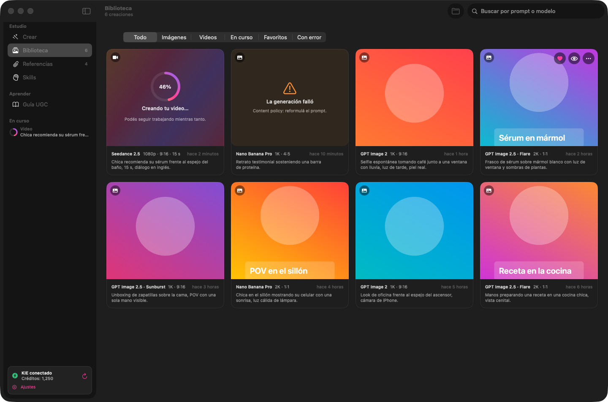
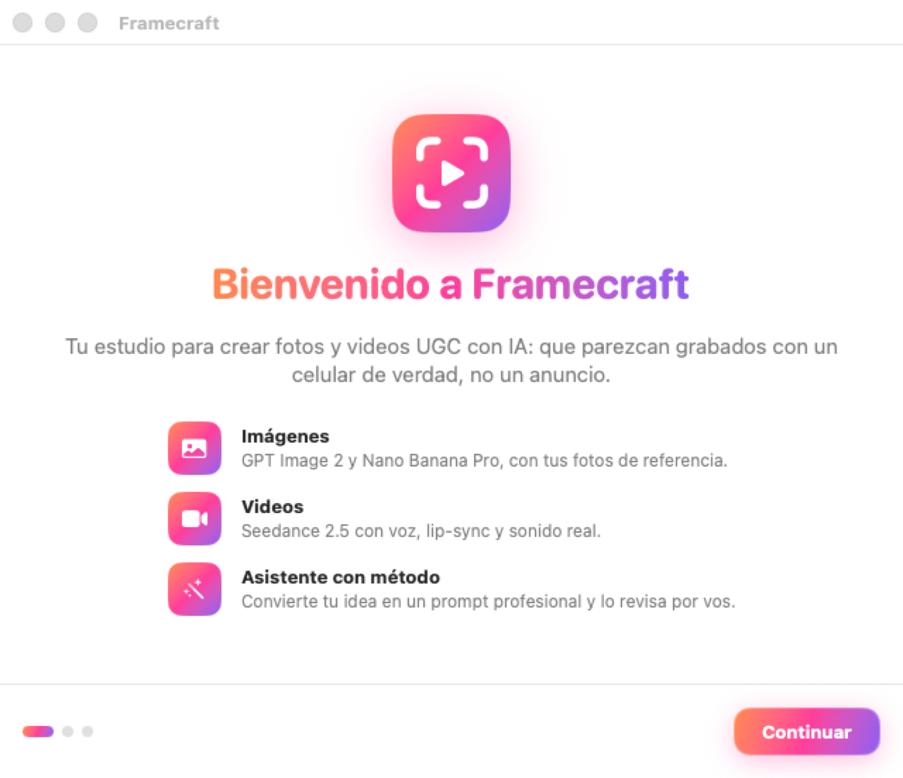

# Framecraft para macOS (Swift)

App nativa de macOS, escrita 100 % en Swift y SwiftUI, para crear fotos y videos
UGC con KIE (GPT Image 2, Nano Banana Pro y Seedance 2.5). Requiere macOS 14
Sonoma o posterior. Funciona en Macs con Apple Silicon y con Intel.


| Biblioteca | Bienvenida |
|---|---|
|  |  |

En macOS 26 o posterior la app usa **Liquid Glass** (barra de generar flotante, avisos y controles de vidrio); en macOS 14 y 15 usa materiales equivalentes.

Más capturas en [`docs/macos/`](../docs/macos/) (se regeneran desde Actions → *macOS app (Swift)* → *Run workflow* con “screenshots”).

## Descargar

1. En GitHub, abrí **Actions → macOS app (Swift)** y entrá en la ejecución más
   reciente con ✅.
2. En **Artifacts**, descargá **Framecraft-macOS** (trae el `.dmg`).
3. Descomprimí el `.zip`, abrí el `.dmg` y arrastrá **Framecraft** a
   **Aplicaciones**. Abrila siempre desde **Aplicaciones**.
4. **La primera vez** macOS la bloquea porque todavía no está firmada con un
   certificado de Apple Developer. En macOS 15 (Sequoia) o posterior el truco de
   "clic derecho → Abrir" ya no funciona; usá una de estas dos opciones:
   - **Ajustes del Sistema:** intentá abrirla (aparece el aviso → *OK*), andá a
     **Ajustes del Sistema → Privacidad y seguridad**, bajá hasta
     *"Se bloqueó Framecraft…"* y tocá **Abrir igualmente**. Confirmá con tu
     contraseña o Touch ID.
   - **Terminal**, una sola vez:
     `xattr -dr com.apple.quarantine /Applications/Framecraft.app`

   Después abre normalmente. Requiere macOS 14 Sonoma o posterior.

## Qué hay adentro

| Pantalla | Para qué |
|---|---|
| **Crear** | Tres pasos: 1) describí tu idea, 2) referencias, 3) ajustes. Imagen o video, con vista previa del prompt final y ⌘↩ para generar. |
| **Asistente** (panel lateral, ⌥⌘I) | Convierte una idea suelta en un prompt listo, siguiendo una *skill*. Muestra el texto en vivo mientras se escribe y podés pedirle ajustes ("más corto", "cambiá la locación") sin empezar de cero. |
| **Revisión del prompt** | En video, chequea en vivo el checklist del kit: bloques de tiempo, densidad de diálogo (2,47 palabras/s), etiquetas @Image/@Video/@Audio que no existen, lenguaje de anuncio, restricciones y audios de referencia. |
| **Biblioteca** | Todo lo generado, con filtros, búsqueda, favoritos, Vista rápida (espacio), arrastrar a Finder, reusar ajustes y **continuar desde el último fotograma** para encadenar clips. |
| **Referencias** | Fotos, videos (≤30 s) y audios (≤30 s). El orden de selección define @Image1, @Image2… Se pueden arrastrar desde Finder a cualquier parte de *Crear*. |
| **Skills** | Las incluidas y las tuyas. Importá cualquier `SKILL.md` (con encabezado YAML `name`/`description`), `.md` o `.txt`, o escribí una nueva. |
| **Guía UGC** | El método del kit de Seedance para leer dentro de la app, más el PDF base y el pack de Walter. |
| **Historias** | Un brief → la historia dividida en escenas, cada una con su prompt, de qué trata y el orden de referencias. Storyboard, **Generar todas las escenas** (en cadena con el último fotograma cuando hace falta) y **Armar video final** en un solo MP4, en tu Mac y sin créditos. |
| **Plantillas** | Testimonio, unboxing, GRWM, antes y después, entrevista callejera, foto de producto, flat lay… Un clic y el asistente queda listo; solo cambiás lo que está entre [corchetes]. |
| **Paleta de comandos** (⌘K) | Escribí para ir a cualquier pantalla, usar una plantilla, abrir una historia o una creación vieja, o generar. |
| **Barra de menús** | El progreso de tus videos y tus últimas creaciones, aunque cierres la ventana (se desactiva en Ajustes). |

### Motores del asistente

| Motor | Modelos | Cómo se usa |
|---|---|---|
| **KIE** | GPT‑5.6 Terra / Luna / Sol (`/codex/v1/responses`), GPT 5.2, Gemini 3.8 Flash, Gemini 3 Flash (`/…/v1/chat/completions`), Claude Opus 4.6 (`/claude/v1/messages`) | Con tu clave de KIE. Botón **Probar conexión** para verificar cada modelo. |
| **ChatGPT (Codex)** | El modelo de tu plan de ChatGPT | Codex CLI viene **incluido en la app**: solo tocás *Iniciar sesión con ChatGPT*. No gasta créditos de KIE. |
| **En este Mac** | Apple Intelligence (macOS 26+, Apple Silicon) | Gratis, privado y sin internet. Usa un método compacto: ideal para prompts cortos; para historias usá KIE o ChatGPT. |
| **OpenAI API** | GPT‑4.1 mini | Con una clave de API de OpenAI (opcional). |

Para imágenes, la skill por defecto es **General** (prompt en texto). El
**Perfil JSON detallado** es opcional y muestra también el prompt principal en texto.

### Skills incluidas

- **UGC de celular · Seedance 2.5** — la skill `prompts-ugc-celular` del kit,
  con su *knowledge* (parámetros de kie.ai, video largo y arco narrativo), las
  lecciones del pack de Walter y la regla de idioma. Opcional: sumar el pack
  completo de Walter como ejemplo (más preciso, usa más tokens).
- **Arthas y Cachito · Omni / Veo 3.1** — la skill de la saga con su elenco,
  lore y filtros.
- **Perfil JSON + biblioteca GPT Image 2** — la que ya tenía la versión web.

## Tus datos

- Creaciones y referencias: **Imágenes ▸ Framecraft** (`~/Pictures/Framecraft`).
- Índice de la biblioteca: `~/Library/Application Support/Framecraft Studio/library.json`.
- Claves de KIE y OpenAI: en el **Llavero** de macOS.

## Desarrollo

Abrí `macos/Package.swift` con Xcode (Archivo ▸ Abrir…) y ejecutá el esquema
**Framecraft**. O desde Terminal:

```bash
cd macos
swift test                 # tests del núcleo
swift run Framecraft       # abre la app
scripts/build-app.sh       # genera build/Framecraft.app y el .dmg
```

| Carpeta | Qué es |
|---|---|
| `Sources/FramecraftCore` | Lógica sin interfaz: presets, clientes de KIE/OpenAI, asistente, skills, revisión del prompt. |
| `Sources/FramecraftCore/Resources/Skills` | Las skills y el material del kit. Para actualizar una skill, reemplazá su `SKILL.md`. |
| `Sources/Framecraft` | La app SwiftUI (`AppModel.swift` coordina todo; `Views/` las pantallas). |
| `Tests/FramecraftCoreTests` | Tests; `Fixtures/web-parity.json` sale del código TypeScript de la versión web para verificar que el port da lo mismo. |

`Framecraft --snapshot <carpeta>` genera capturas de todas las pantallas con
datos de ejemplo (lo usa CI).

### Firmar y notarizar (opcional)

Con una cuenta de Apple Developer:
`SIGN_IDENTITY="Developer ID Application: …" scripts/build-app.sh` y después
`xcrun notarytool submit build/Framecraft-*.dmg --wait` + `xcrun stapler staple`.
